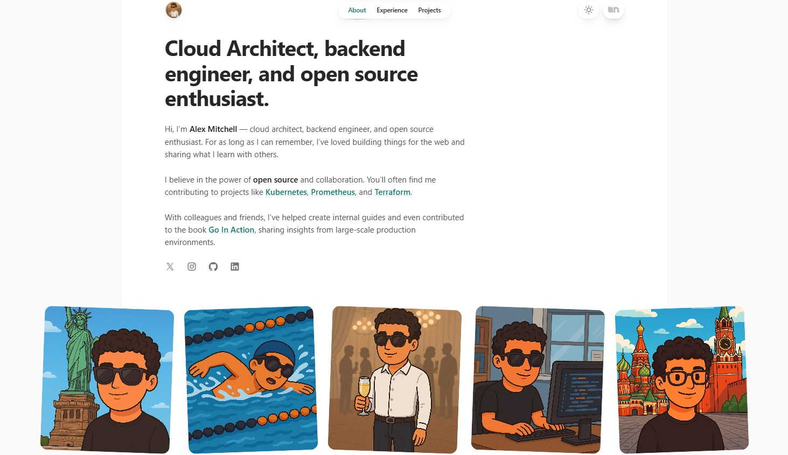

# Spotlight

Spotlight is a [Tailwind UI](https://tailwindui.com) site template built using [Tailwind CSS](https://tailwindcss.com) and [Next.js](https://nextjs.org).

<p align="center">
  
</p>

## Getting started

To get started with this template, first install the npm dependencies:

```bash
npm install
```

Then create a `.env.local` file in the root of your project and set the `NEXT_PUBLIC_SITE_URL` variable to the public URL of your site, as well as the necessary data for SMTP configuration. The structure should be as in `.env.example`:

```
NEXT_PUBLIC_SITE_URL=https://example.com        # The public URL of your site (used for absolute links, sharing, etc.)
SMTP_HOST=                                     # SMTP server address for sending emails (e.g., smtp.gmail.com)
SMTP_PASS=                                     # SMTP account password or app-specific password
SMTP_USER=                                     # SMTP username (usually your email address)
SMTP_PORT=                                     # SMTP server port (e.g., 587 for TLS, 465 for SSL)
SMTP_SECURE=                                   # Use SSL/TLS? Set to 'true' for port 465, 'false' for 587
MY_EMAIL=
```

Next, run the development server:

```bash
npm run dev
```

Finally, open [http://localhost:3000](http://localhost:3000) in your browser to view the website.

## Customizing

You can start editing this template by modifying the files in the `/src` folder. The site will auto-update as you edit these files.

## Code Blocks
extension:filename {highlightLines} showLineNumbers
```go:document.go {1,3-4} showLineNumbers
type Document struct {
	Hash         string
	Path         string
	PreviousPath string
	Operation    *CognitiveOperation
	Results      *CognitiveReadResponse
}
```

## License

This site template is a commercial product and is licensed under the [Tailwind UI license](https://tailwindui.com/license).

## Learn more

To learn more about the technologies used in this site template, see the following resources:

- [Tailwind CSS](https://tailwindcss.com/docs) - the official Tailwind CSS documentation
- [Next.js](https://nextjs.org/docs) - the official Next.js documentation
- [Headless UI](https://headlessui.dev) - the official Headless UI documentation
- [MDX](https://mdxjs.com) - the MDX documentation
